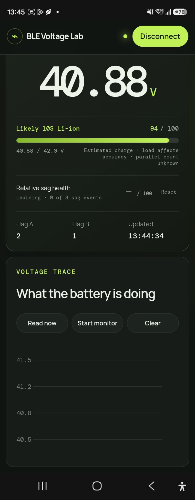

# BLE Voltage Lab

A local-first Web Bluetooth dashboard for the **KONNWEI BK300** and other
BKmonitor-compatible battery voltage monitors. It connects directly from a
supported browser, displays live terminal voltage, graphs readings, reads the
device identifier, and exposes a decoded packet log.

For readings between 30 and 42.5 V, the dashboard treats the battery as a
likely 10S conventional lithium-ion pack: 42.0 V full (10 × 4.2 V). It shows a
voltage-based charge estimate, not a BMS state-of-charge reading. Parallel
count such as `4P` cannot be inferred from terminal voltage.

While continuous monitoring is active, the app detects voltage-sag and
recovery events. It stores up to 50 events in browser local storage and, after
three events, reports a relative sag-health trend against that pack's best
recorded behaviour. During a detected sag, the fuel estimate uses the pre-sag
voltage. Because current is unknown, the health trend is meaningful only when
the compared loads are broadly similar; it is not a BMS SOH measurement.

It is also an installable Progressive Web App. Once loaded, the interface
remains available offline; Bluetooth access still requires a compatible
browser and a nearby device.

<p align="center">
  <a href="https://jr551.github.io/ChinaBLEVoltageMonitor/">
    
  </a>
</p>

This project turns the original
[BKmonitor protocol reverse-engineering gist](https://gist.github.com/jr551/21f1e88d8efa7113deb9c139310b23b9)
into a tested, maintainable repository.

## Hardware

The reverse engineering was verified with a KONNWEI-branded unit advertising
as `bikebattery`. The same BK300 hardware and protocol may be sold under other
brand names.

- [Example AliExpress BK300 listing](https://s.click.aliexpress.com/e/_c3i1uXXr)
  (item `1005007797314538`)
- Observed price: approximately **£6.49** in July 2026; marketplace prices,
  taxes, delivery costs, and variants change.

The linked listing describes the device as a “BK300 Lead Acid Starting Car
Battery Detector” for 12 V and 24 V systems. A matching case or product name
does not guarantee matching firmware, so verify service UUID `FFF0` before
experimenting.

## Try it

Web Bluetooth requires a secure context. Use the published GitHub Pages site,
or run the local development server:

```bash
npm install
npm run dev
```

Open the displayed `localhost` URL in Chrome or Edge on desktop or Android,
select the monitor (tested name: `bikebattery`), then use **Read now** or
**Start monitor**.

Safari and Firefox do not currently expose Web Bluetooth. iOS browsers cannot
use this app because they all use WebKit.

## Safety

Only the verified, read-only commands `02 01` and `0B 0B` have one-click
controls. Commands with incomplete payload semantics and state-changing
commands are shown as locked documentation. The raw console is intended for
protocol research on hardware you own and can recover.

## Development

```bash
npm test
npm run build
```

The protocol implementation is dependency-free and lives in
[`src/protocol.js`](src/protocol.js). It includes CRC-16/X-25 framing, response
validation, and notification-fragment reassembly.

## Protocol

The tested device exposes service `FFF0`, notification characteristic `FFF1`,
and write-without-response characteristic `FFF2`. See
[`protocol/BKMONITOR_BLE_PROTOCOL.md`](protocol/BKMONITOR_BLE_PROTOCOL.md).

## Contributing

Captures and decoded payloads are welcome. Redact device identifiers,
manufacturer data, and other unique values before opening an issue.

This is independent interoperability research, not vendor documentation.

## ESP32 screen demo

[`esp32demo/`](esp32demo/) contains compile-tested PlatformIO firmware for the
Waveshare ESP32-C6-LCD-1.47 board. It connects directly to the monitor and
renders voltage, 10S fuel estimate, flags, RSSI, and a short trace on the
onboard 320×172 landscape display.
